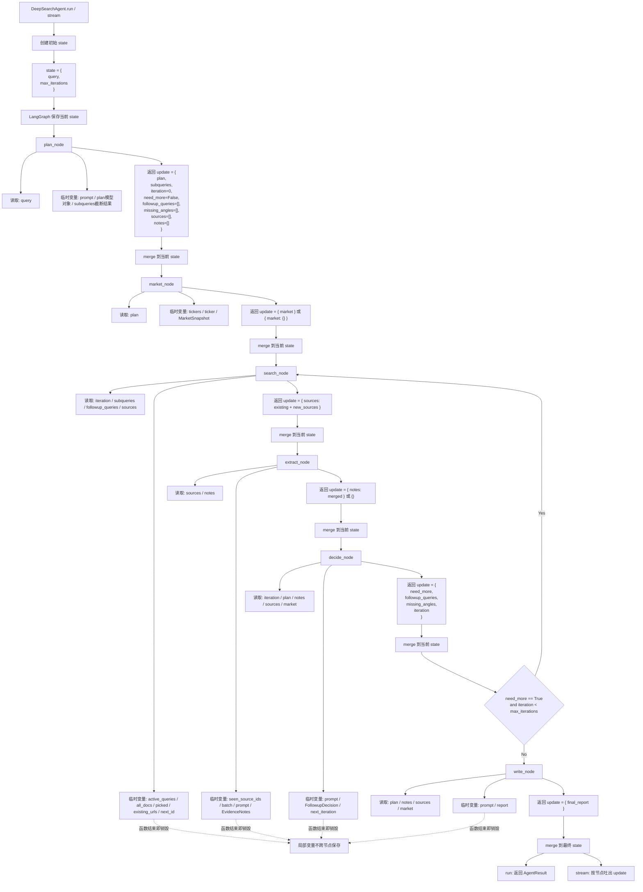
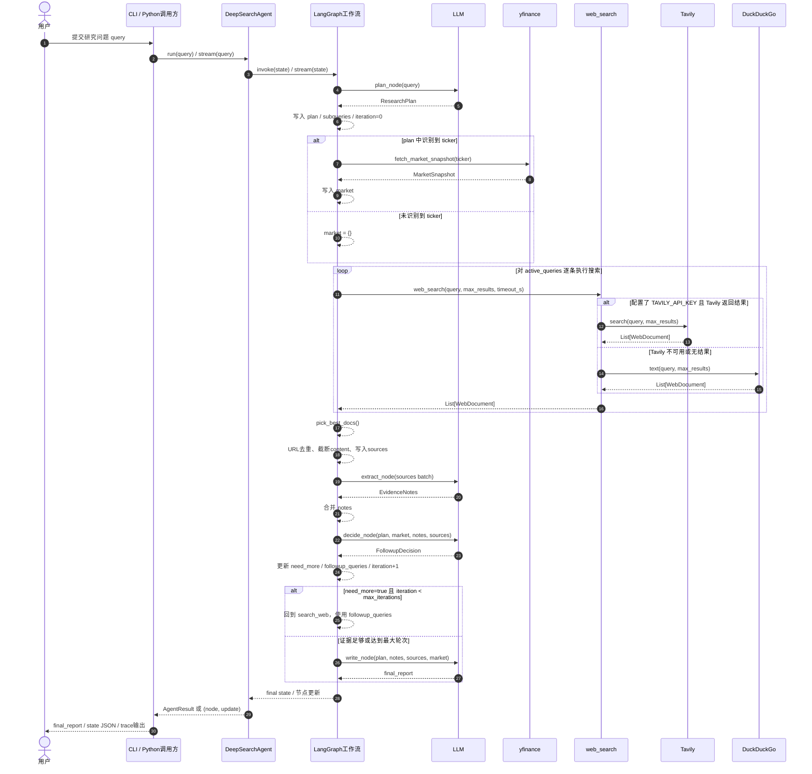

# CS5260-Stock_Agent 当前接口文档

本文档基于当前仓库代码实现整理，而不是基于 README 预期行为推断。

截至目前，项目**没有**提供 HTTP/REST/gRPC/WebSocket 服务接口。当前可用接口分为 3 类：

1. 命令行接口：`stock-agent`
2. Python 调用接口：`stock_agent.agent.DeepSearchAgent`
3. 工具函数接口：网页搜索与行情抓取工具

## 1. 项目入口概览

### 1.1 CLI 入口

- 安装后命令名：`stock-agent`
- 定义位置：`src/stock_agent/cli.py`
- 打包入口：`pyproject.toml` 中 `[project.scripts] stock-agent = "stock_agent.cli:main"`

### 1.2 Python 主入口

- 类名：`DeepSearchAgent`
- 定义位置：`src/stock_agent/agent.py`
- 主要能力：
  - `run(query)`：同步执行完整研究流程，返回最终报告和完整状态
  - `stream(query)`：按节点流式返回执行过程中的状态更新

## 2. 环境变量接口

### 2.1 LLM 相关

#### `DEEPSEEK_API_KEY`

- 含义：若存在，则优先使用 DeepSeek 作为模型提供方
- 是否必填：否

#### `DEEPSEEK_MODEL`

- 含义：DeepSeek 模型名
- 默认值：回退到 `OPENAI_MODEL` 的值；若未设置则继续回退为 `gpt-4o-mini`

#### `DEEPSEEK_BASE_URL`

- 含义：DeepSeek API Base URL
- 默认值：`https://api.deepseek.com/v1`

#### `OPENAI_API_KEY`

- 含义：当 `DEEPSEEK_API_KEY` 不存在时，使用 OpenAI 所需的 API Key
- 是否必填：条件必填
- 缺失行为：抛出异常 `缺少环境变量 DEEPSEEK_API_KEY 或 OPENAI_API_KEY`

#### `OPENAI_MODEL`

- 含义：OpenAI 模型名，同时也是 DeepSeek 未显式指定模型时的默认模型名来源
- 默认值：`gpt-4o-mini`

### 2.2 搜索与执行配置

#### `TAVILY_API_KEY`

- 含义：若存在，网页搜索优先走 Tavily；否则回退 DuckDuckGo
- 是否必填：否

#### `STOCK_AGENT_MAX_ITERATIONS`

- 含义：最多允许多少轮 `search_web -> extract -> decide` 循环
- 默认值：`2`

#### `STOCK_AGENT_MAX_RESULTS`

- 含义：每个搜索 query 最多抓取多少条原始结果
- 默认值：`5`

#### `STOCK_AGENT_TIMEOUT_S`

- 含义：搜索超时配置
- 默认值：`25`
- 说明：当前代码会把该值传入 `web_search(...)`，但工具层没有真正对 Tavily 或 DuckDuckGo 强制超时控制

## 3. 命令行接口

### 3.1 命令格式

```bash
stock-agent <query> [--json] [--no-trace]
```

### 3.2 参数说明

#### `query`

- 类型：`str`
- 位置：必填位置参数
- 含义：研究问题，例如：

```bash
stock-agent "Deep dive on NVDA: key catalysts and risks over the next 6-12 months"
```

#### `--json`

- 类型：布尔开关
- 含义：输出完整 `state` JSON，而不是只展示最终报告

#### `--no-trace`

- 类型：布尔开关
- 含义：禁用逐步执行日志与节点面板，只输出最终报告

### 3.3 输出行为

#### 默认模式

- 开启 logging trace
- 按节点输出执行进度面板
- 最后输出 `final_report`

节点包括：

- `plan`
- `market`
- `search_web`
- `extract`
- `decide`
- `write_report`

#### `--json` 模式

- 直接执行 `agent.run(query)`
- 输出完整状态字典 JSON

#### `--no-trace` 模式

- 直接执行 `agent.run(query)`
- 输出最终报告

#### `--json` 与 `--no-trace` 同时出现

- 以 `--json` 为准

### 3.4 退出码

- `0`：成功
- `1`：运行异常

### 3.5 典型输出结构

`--json` 模式下返回的是完整工作流状态，字段见“5. 状态对象接口”。

## 4. Python 接口

### 4.1 `AgentConfig`

定义位置：`src/stock_agent/config.py`

```python
from stock_agent.config import AgentConfig

config = AgentConfig(
    openai_model="gpt-4o-mini",
    max_iterations=2,
    max_results_per_query=5,
    timeout_s=25,
)
```

字段如下：

- `openai_model: str = "gpt-4o-mini"`
- `max_iterations: int = 2`
- `max_results_per_query: int = 5`
- `timeout_s: int = 25`

可通过 `AgentConfig.from_env()` 从环境变量生成配置。

### 4.2 `AgentResult`

定义位置：`src/stock_agent/agent.py`

```python
@dataclass(frozen=True)
class AgentResult:
    final_report: str
    state: Dict[str, Any]
```

### 4.3 `DeepSearchAgent`

定义位置：`src/stock_agent/agent.py`

### 构造函数

```python
DeepSearchAgent(config: Optional[AgentConfig] = None)
```

行为说明：

- 自动执行 `load_dotenv()`
- 若未传 `config`，则自动读取 `AgentConfig.from_env()`
- 初始化 LangGraph 工作流

### 属性

#### `config`

```python
agent.config -> AgentConfig
```

返回当前实例持有的配置对象。

### 方法

#### `run`

```python
run(query: str) -> AgentResult
```

输入：

- `query`：研究问题

返回：

- `AgentResult.final_report`：最终英文研究报告
- `AgentResult.state`：完整状态字典

调用示例：

```python
from stock_agent.agent import DeepSearchAgent

agent = DeepSearchAgent()
result = agent.run("Research NVDA over the next 12 months")
print(result.final_report)
print(result.state["sources"])
```

#### `stream`

```python
stream(query: str) -> Iterator[Tuple[str, Dict[str, Any]]]
```

输入：

- `query`：研究问题

返回：

- 流式迭代器，每次返回 `(node_name, update_dict)`

节点名通常为：

- `plan`
- `market`
- `search_web`
- `extract`
- `decide`
- `write_report`

示例：

```python
from stock_agent.agent import DeepSearchAgent

agent = DeepSearchAgent()
for node, update in agent.stream("Research NVDA over the next 12 months"):
    print(node, update)
```

### 4.4 工作流顺序

固定执行路径：

```text
plan -> market -> search_web -> extract -> decide
```

条件分支：

- 若 `need_more == True` 且 `iteration < max_iterations`：

```text
decide -> search_web
```

- 否则：

```text
decide -> write_report -> END
```

## 5. 状态对象接口

LangGraph 使用的状态对象定义在 `DeepSearchState` 中。当前字段如下：

```python
{
    "query": str,
    "iteration": int,
    "max_iterations": int,
    "plan": dict,
    "subqueries": list[str],
    "sources": list[dict],
    "notes": list[dict],
    "market": dict,
    "need_more": bool,
    "followup_queries": list[str],
    "missing_angles": list[str],
    "final_report": str,
}
```

### 5.1 `plan`

结构来源：`ResearchPlan`

```python
{
    "topic": str,
    "tickers": list[str],
    "subqueries": list[str],
    "assumptions": list[str],
}
```

说明：

- `plan` 由 LLM 生成
- `subqueries` 最终只保留前 10 条

### 5.2 `sources`

当前实现结构：

```python
[
    {
        "id": int,
        "title": str,
        "url": str,
        "content": str,
    }
]
```

说明：

- `id` 从 1 开始递增
- `content` 会被截断，最大约 2400 字符
- 新增 source 会按 URL 去重
- 每轮搜索后最多保留本轮筛选出的 12 条新文档

### 5.3 `notes`

结构来源：`EvidenceNote`

```python
[
    {
        "source_id": int,
        "claim": str,
        "why_it_matters": str,
    }
]
```

说明：

- `source_id` 关联 `sources[].id`
- `extract` 节点每次最多处理 8 个尚未抽取过的 source
- 提示词要求每个 source 最多抽取 2 条 note，但这属于模型约束，不是代码硬限制

### 5.4 `market`

结构来源：`MarketSnapshot`

```python
{
    "ticker": str,
    "currency": str | None,
    "price": float | None,
    "market_cap": float | None,
    "trailing_pe": float | None,
    "forward_pe": float | None,
    "dividend_yield": float | None,
}
```

说明：

- 仅使用 `plan.tickers` 中的第一个 ticker
- 若未识别到 ticker，则 `market = {}`

### 5.5 `followup_queries`

- 类型：`list[str]`
- 来源：`decide` 节点
- 用途：当证据不足时，下一轮 `search_web` 优先使用这里的 query，而不是初始 `subqueries`

### 5.6 `final_report`

- 类型：`str`
- 生成节点：`write_report`
- 语言：英文
- 目标结构：
  - Executive Summary
  - Bull Case
  - Bear Case
  - Key Catalysts
  - Key Risks
  - Open Questions
  - Sources

### 5.7 State 的三层表现形式

这部分最容易混淆，实际有 3 个层次：

#### 第一层：类型定义层

- 名称：`DeepSearchState`
- 位置：`src/stock_agent/graphs/deep_search_graph.py`
- 类型：`TypedDict`
- 作用：约束“这个 state 里理论上可能有哪些字段”

它不是：

- 数据库表
- dataclass 实例
- 持久化对象
- 真正的运行时容器

#### 第二层：LangGraph 运行时状态层

- 真正流转的是普通 Python `dict`
- 这个 `dict` 在 `run()` / `stream()` 启动时被创建
- 每个节点收到的是“当前 state”
- 每个节点返回一个“局部更新 dict”
- LangGraph 再把这个局部更新 merge 回当前 state

也就是说，真正保存中间结果的是：

```python
dict
```

而不是 `DeepSearchState` 这个类型名本身。

#### 第三层：CLI 展示层的影子 state

默认 CLI trace 模式下，[cli.py](/home/yuhang/workspace/CS5260-Stock_Agent-main/src/stock_agent/cli.py#L81) 还会维护一个本地 `state`：

```python
state: dict = {"query": args.query, "max_iterations": agent.config.max_iterations}
for node, update in agent.stream(args.query):
    if isinstance(update, dict):
        state.update(update)
```

这个 state 的作用只有一个：

- 给命令行界面打印每一步的前后变化

它不是 LangGraph 的权威存储，只是根据 `stream()` 返回的 update 在 CLI 侧重新拼出来的一份副本。

### 5.8 State 详细生命周期图

说明：

- 图里区分了“运行时 state”和“节点内部临时变量”
- 只有写回 state 的内容，才会进入下一节点
- 临时变量在节点函数结束后就失效



### 5.9 一个完整调用中的 state 演化示例

下面不是代码真实输出，而是按照当前实现整理的结构化示例。

#### 初始 state

由 [agent.py](/home/yuhang/workspace/CS5260-Stock_Agent-main/src/stock_agent/agent.py#L28) 或 [agent.py](/home/yuhang/workspace/CS5260-Stock_Agent-main/src/stock_agent/agent.py#L37) 创建：

```python
{
    "query": "Deep dive on NVDA over the next 12 months",
    "max_iterations": 2,
}
```

#### `plan_node` 之后

```python
{
    "query": "Deep dive on NVDA over the next 12 months",
    "max_iterations": 2,
    "plan": {
        "topic": "NVDA research",
        "tickers": ["NVDA"],
        "subqueries": [...],
        "assumptions": [...],
    },
    "subqueries": [...],
    "iteration": 0,
    "need_more": False,
    "followup_queries": [],
    "missing_angles": [],
    "sources": [],
    "notes": [],
}
```

#### `market_node` 之后

```python
{
    ...,
    "market": {
        "ticker": "NVDA",
        "currency": "USD",
        "price": 182.81,
        "market_cap": 4450875342848.0,
        "trailing_pe": 45.25,
        "forward_pe": 23.63,
        "dividend_yield": 0.02,
    }
}
```

#### 第一轮 `search_node` 之后

注意：这里不是只返回“新增部分”，而是节点内部先读旧 `sources`，再自己拼成完整新列表返回。

```python
{
    ...,
    "sources": [
        {"id": 1, "title": "...", "url": "...", "content": "..."},
        {"id": 2, "title": "...", "url": "...", "content": "..."},
    ]
}
```

#### 第一轮 `extract_node` 之后

同样，`notes` 也是节点内部自己把旧值和新值合并后再返回：

```python
{
    ...,
    "notes": [
        {
            "source_id": 1,
            "claim": "...",
            "why_it_matters": "...",
        }
    ]
}
```

#### `decide_node` 之后

```python
{
    ...,
    "need_more": True,
    "followup_queries": [
        "NVDA latest earnings call highlights",
        "NVDA China exposure export controls",
    ],
    "missing_angles": [
        "regulation",
        "customer concentration",
    ],
    "iteration": 1,
}
```

#### 第二轮 `search_node` 之后

此时会优先用 `followup_queries` 搜索，并继续在原有 `sources` 上追加：

```python
{
    ...,
    "sources": [
        {"id": 1, ...},
        {"id": 2, ...},
        {"id": 3, ...},
        {"id": 4, ...},
    ]
}
```

#### `write_node` 之后

```python
{
    ...,
    "final_report": "## Executive Summary\n..."
}
```

### 5.10 State merge 规则

这一点很重要，当前项目不是“自动按字段语义追加”，而是“节点自己决定如何返回，LangGraph 再按 key 合并”。

可以把它理解为：

```python
current_state = {...旧状态...}
update = node(current_state)
current_state = {**current_state, **update}
```

对当前项目来说，实际效果如下：

| 字段 | merge 方式 | 谁负责 |
| --- | --- | --- |
| `plan` | 直接覆盖/写入 | `plan_node` |
| `subqueries` | 直接覆盖/写入 | `plan_node` |
| `iteration` | 直接覆盖为新值 | `plan_node` / `decide_node` |
| `need_more` | 直接覆盖 | `plan_node` / `decide_node` |
| `followup_queries` | 直接覆盖 | `plan_node` / `decide_node` |
| `missing_angles` | 直接覆盖 | `plan_node` / `decide_node` |
| `market` | 直接覆盖 | `market_node` |
| `final_report` | 直接覆盖/写入 | `write_node` |
| `sources` | 节点内部手工合并后整体覆盖 | `search_node` |
| `notes` | 节点内部手工合并后整体覆盖 | `extract_node` |

所以：

- `sources` 不是 LangGraph 自动 append 的
- `notes` 也不是 LangGraph 自动 append 的
- 真正的“追加逻辑”写在节点函数内部

这在代码里非常明确：

- `search_node`：`return {"sources": existing + new_sources}`
- `extract_node`：`return {"notes": merged}`

如果以后有人把节点改成只返回新增部分，例如：

```python
return {"sources": new_sources}
```

那旧 `sources` 就会被覆盖掉，而不是自动累加。

### 5.11 字段生命周期表

| 字段 | 首次创建节点 | 后续谁会读取 | 后续谁会更新 | 生命周期说明 |
| --- | --- | --- | --- | --- |
| `query` | `run()` / `stream()` 初始化 | `plan_node` | 无 | 从开始到结束一直存在 |
| `max_iterations` | `run()` / `stream()` 初始化 | `route_after_decide` | 无 | 控制循环上限 |
| `plan` | `plan_node` | `market_node` `decide_node` `write_node` | 不再更新 | 一次生成后常驻 |
| `subqueries` | `plan_node` | `search_node` `decide_node` | 不再更新 | 第一轮搜索主输入 |
| `iteration` | `plan_node` 设为 `0` | `search_node` `decide_node` `route_after_decide` | `decide_node` | 每轮 decide 后 +1 |
| `sources` | `plan_node` 初始化为空列表 | `search_node` `extract_node` `decide_node` `write_node` | `search_node` | 多轮检索累计结果 |
| `notes` | `plan_node` 初始化为空列表 | `extract_node` `decide_node` `write_node` | `extract_node` | 多轮抽取累计结果 |
| `market` | `market_node` | `decide_node` `write_node` | `market_node` | 只计算一次 |
| `need_more` | `plan_node` 设为 `False` | `route_after_decide` | `decide_node` | 控制是否继续检索 |
| `followup_queries` | `plan_node` 设为空列表 | `search_node` | `decide_node` | 第二轮及后续轮次的搜索输入 |
| `missing_angles` | `plan_node` 设为空列表 | 理论上供后续分析使用 | `decide_node` | 记录证据缺口 |
| `final_report` | `write_node` | CLI 输出 / `AgentResult` | 无 | 最终产物 |

### 5.12 哪些中间值不会进入 state

不会进入 state 的，不是“不重要”，而是它们只在当前节点执行期间有意义。

#### `plan_node` 的局部值

- `prompt`
- `plan` 这个 `ResearchPlan` 模型对象本身
- 兜底生成过程中的临时对象

最终只有 `plan.model_dump()` 和相关字段写回 state。

#### `search_node` 的局部值

- `active_queries`
- `all_docs`
- `picked`
- `existing_urls`
- `next_id`

最终只有整理后的 `sources` 列表写回 state。

#### `extract_node` 的局部值

- `seen_source_ids`
- `batch`
- `prompt`
- `out` 这个 `EvidenceNotes` 对象

最终只有 `notes` 列表写回 state。

#### `decide_node` 的局部值

- `prompt`
- `decision` 这个 `FollowupDecision` 对象
- `next_iteration`

最终只把 4 个字段写回 state：

- `need_more`
- `followup_queries`
- `missing_angles`
- `iteration`

#### `write_node` 的局部值

- `prompt`
- `report` 原始模型返回对象

最终只有字符串化后的 `final_report` 写回 state。

### 5.13 当前 state 存储位置与销毁时机

#### 存在哪里

- 存储介质：Python 进程内存
- 运行时载体：LangGraph 持有的当前 `dict`
- 当前项目没有：
  - 数据库持久化
  - 文件落盘
  - Redis
  - checkpointer

#### 什么时候创建

在 [agent.py](/home/yuhang/workspace/CS5260-Stock_Agent-main/src/stock_agent/agent.py#L28) 和 [agent.py](/home/yuhang/workspace/CS5260-Stock_Agent-main/src/stock_agent/agent.py#L37) 中创建初始 state。

#### 什么时候销毁

- `run()` 执行完成后，LangGraph 内部运行态结束
- 但最终 state 会被拷贝到 `AgentResult.state` 返回给调用方
- 如果调用方不保存它，这份结果随后会被 Python 垃圾回收

#### `stream()` 的情况

- `stream()` 每次吐出 `(node, update)`
- LangGraph 内部仍然持有真实 current state
- CLI 为了展示效果，会在本地再维护一份影子 state
- 这份影子 state 也是纯内存，不持久化

#### 异常情况下

- 如果中途抛异常且没有外部持久化，当前运行时 state 不会自动保存
- 当前项目也没有“断点续跑”能力

## 6. 工具函数接口

### 6.1 网页搜索工具

定义位置：`src/stock_agent/tools/web_search.py`

### `WebDocument`

```python
@dataclass(frozen=True)
class WebDocument:
    title: str
    url: str
    content: str
```

### `web_search`

```python
web_search(query: str, max_results: int = 5, timeout_s: int = 25) -> List[WebDocument]
```

行为：

- 若设置了 `TAVILY_API_KEY`，优先调用 Tavily
- Tavily 无结果时，回退到 DuckDuckGo
- 返回统一格式的 `WebDocument` 列表

### `pick_best_docs`

```python
pick_best_docs(
    docs: List[WebDocument],
    *,
    limit: int = 6,
    require_url: bool = True,
) -> List[WebDocument]
```

行为：

- 按输入顺序挑选
- 基于 `url` 或 `title` 去重
- 默认要求文档必须有 URL
- 达到 `limit` 后停止

### 6.2 市场数据工具

定义位置：`src/stock_agent/tools/market_data.py`

### `MarketSnapshot`

```python
@dataclass(frozen=True)
class MarketSnapshot:
    ticker: str
    currency: Optional[str]
    price: Optional[float]
    market_cap: Optional[float]
    trailing_pe: Optional[float]
    forward_pe: Optional[float]
    dividend_yield: Optional[float]
```

### `fetch_market_snapshot`

```python
fetch_market_snapshot(ticker: str) -> MarketSnapshot
```

行为：

- 基于 `yfinance.Ticker(ticker).info` 取数
- 尝试返回：
  - `currency`
  - `currentPrice` 或 `regularMarketPrice`
  - `marketCap`
  - `trailingPE`
  - `forwardPE`
  - `dividendYield`

失败处理：

- 若 `t.info` 获取异常，则使用空字典继续返回
- 各字段无法转成浮点时返回 `None`

## 7. 当前接口边界与注意事项

### 7.1 当前没有 Web API

以下接口当前都不存在：

- REST API
- FastAPI/Flask 服务
- OpenAPI/Swagger 文档
- WebSocket 推流接口

如果后续需要对外提供 HTTP 服务，应在现有 `DeepSearchAgent` 之上再包一层服务接口。

### 7.2 输出报告语言固定为英文

虽然 CLI 帮助文本和 README 含中文说明，但提示词明确要求：

- `plan` 输出英文
- `extract` 输出英文
- `decide` 输出英文
- `write_report` 输出英文报告

### 7.3 容错逻辑较强，但不保证结构质量

- `plan`、`extract`、`decide` 都带有模型解析失败后的兜底逻辑
- 兜底后流程仍会继续
- 因此接口在“可运行性”上较稳，但输出内容质量依赖模型与检索结果

### 7.4 包导出较少

当前 `src/stock_agent/__init__.py` 只导出了 `__version__`，因此使用 Python 接口时更稳妥的导入方式是：

```python
from stock_agent.agent import DeepSearchAgent
from stock_agent.config import AgentConfig
```

而不是依赖包根导出。

## 8. 时序图

### 8.1 端到端执行时序图

说明：

- 该图对应当前主流程 `plan -> market -> search_web -> extract -> decide -> write_report`
- 既适用于 CLI，也适用于 Python `DeepSearchAgent.run()` 调用
- 若是 CLI 默认模式，内部实际走的是 `stream()`，但核心节点执行顺序一致



### 8.2 CLI 输出模式差异

- 默认模式：CLI 调用 `agent.stream(query)`，边执行边打印各节点 trace，最后输出 `final_report`
- `--json` 模式：CLI 调用 `agent.run(query)`，直接输出完整 `state`
- `--no-trace` 模式：CLI 调用 `agent.run(query)`，只输出最终报告

## 9. 项目中的 dataclass 清单

说明：

- 当前业务代码中的 `dataclass` 全部使用 `@dataclass(frozen=True)`，即实例创建后不可变
- 下面先列出真正的 `dataclass`
- 再补充说明那些虽然不是 `dataclass`，但实际定义了 agent 输入输出格式的 `Pydantic` / `TypedDict` 模型

### 9.1 业务 dataclass

| 名称 | 定义位置 | 字段 | 作用 |
| --- | --- | --- | --- |
| `AgentConfig` | `src/stock_agent/config.py` | `openai_model: str` `max_iterations: int` `max_results_per_query: int` `timeout_s: int` | 统一保存 Agent 运行配置 |
| `AgentResult` | `src/stock_agent/agent.py` | `final_report: str` `state: Dict[str, Any]` | `DeepSearchAgent.run()` 的返回对象 |
| `WebDocument` | `src/stock_agent/tools/web_search.py` | `title: str` `url: str` `content: str` | 统一封装网页搜索结果 |
| `MarketSnapshot` | `src/stock_agent/tools/market_data.py` | `ticker: str` `currency: Optional[str]` `price: Optional[float]` `market_cap: Optional[float]` `trailing_pe: Optional[float]` `forward_pe: Optional[float]` `dividend_yield: Optional[float]` | 统一封装行情快照 |

### 9.2 测试 dataclass

| 名称 | 定义位置 | 字段 | 作用 |
| --- | --- | --- | --- |
| `_Msg` | `tests/test_deep_search_graph.py` | `content: str` | 仅用于单测中的假 LLM 返回值，不属于业务接口 |

### 9.3 每个 dataclass 的详细作用与格式

### `AgentConfig`

格式：

```python
AgentConfig(
    openai_model: str = "gpt-4o-mini",
    max_iterations: int = 2,
    max_results_per_query: int = 5,
    timeout_s: int = 25,
)
```

作用：

- 保存顶层 Agent 运行时配置
- 被 `DeepSearchAgent` 持有
- 被图构建函数 `build_deep_search_graph(config)` 和模型初始化逻辑 `get_chat_model(config)` 使用

### `AgentResult`

格式：

```python
AgentResult(
    final_report: str,
    state: Dict[str, Any],
)
```

作用：

- 作为 `DeepSearchAgent.run(query)` 的标准返回值
- `final_report` 是最终英文研究报告
- `state` 是整个 LangGraph 执行完成后的完整状态快照

### `WebDocument`

格式：

```python
WebDocument(
    title: str,
    url: str,
    content: str,
)
```

作用：

- 作为 Tavily / DuckDuckGo 搜索结果的统一中间格式
- 先由 `web_search()` 返回
- 再由 `search_node` 进一步去重、截断、转成 `sources` 列表

### `MarketSnapshot`

格式：

```python
MarketSnapshot(
    ticker: str,
    currency: str | None,
    price: float | None,
    market_cap: float | None,
    trailing_pe: float | None,
    forward_pe: float | None,
    dividend_yield: float | None,
)
```

作用：

- 作为 `fetch_market_snapshot(ticker)` 的标准返回值
- 对 `yfinance.Ticker(ticker).info` 做字段抽取和类型归一化
- 在 `market_node` 中被转成字典并写入状态字段 `market`

### 9.4 非 dataclass，但决定节点输入输出格式的模型

以下模型虽然不是 `dataclass`，但实际决定了多个节点的输入输出结构：

| 名称 | 类型 | 定义位置 | 作用 |
| --- | --- | --- | --- |
| `ResearchPlan` | `Pydantic BaseModel` | `src/stock_agent/graphs/deep_search_graph.py` | `plan_node` 的核心输出格式 |
| `EvidenceNote` | `Pydantic BaseModel` | `src/stock_agent/graphs/deep_search_graph.py` | 单条证据 note 格式 |
| `EvidenceNotes` | `Pydantic BaseModel` | `src/stock_agent/graphs/deep_search_graph.py` | `extract_node` 输出容器 |
| `FollowupDecision` | `Pydantic BaseModel` | `src/stock_agent/graphs/deep_search_graph.py` | `decide_node` 输出格式 |
| `DeepSearchState` | `TypedDict` | `src/stock_agent/graphs/deep_search_graph.py` | 整个图运行时状态结构 |

## 10. 每个 agent 的 input / output

这里分成两层来理解：

1. 顶层 agent：`DeepSearchAgent`
2. 工作流节点：`plan`、`market`、`search_web`、`extract`、`decide`、`write_report`

其中第二层虽然在代码里是 graph node，不是 class 形式的独立 agent，但从职责上可以视为“子 agent”。

### 10.1 顶层 `DeepSearchAgent`

### `__init__(config: Optional[AgentConfig] = None)`

输入：

```python
config: AgentConfig | None
```

输入内容：

- 可选运行配置
- 若为 `None`，则自动从环境变量读取

输出：

- 返回一个初始化完成的 `DeepSearchAgent` 实例

内部副作用：

- 调用 `load_dotenv()`
- 构建 LangGraph 工作流对象

### `run(query: str) -> AgentResult`

输入：

```python
query: str
```

内部初始状态格式：

```python
{
    "query": query,
    "max_iterations": self._config.max_iterations,
}
```

输出：

```python
AgentResult(
    final_report: str,
    state: Dict[str, Any],
)
```

输出内容说明：

- `final_report`：最终英文研究报告
- `state`：图执行结束后的完整状态，结构见第 5 节

### `stream(query: str) -> Iterator[Tuple[str, Dict[str, Any]]]`

输入：

```python
query: str
```

内部初始状态格式：

```python
{
    "query": query,
    "max_iterations": self._config.max_iterations,
}
```

输出：

```python
Iterator[Tuple[str, Dict[str, Any]]]
```

单次迭代输出格式：

```python
(node_name: str, update_dict: Dict[str, Any])
```

典型输出示例：

```python
("plan", {
    "plan": {...},
    "subqueries": [...],
    "iteration": 0,
    "need_more": False,
    "followup_queries": [],
    "missing_angles": [],
    "sources": [],
    "notes": [],
})
```

说明：

- 正常情况下，`node_name` 是节点名
- 若 LangGraph 返回的不是标准单节点更新，代码会包装成：

```python
("event", {"_raw": ...})
```

### 10.2 `plan` 节点

职责：

- 把用户 query 转成研究计划

函数签名：

```python
plan_node(state: DeepSearchState) -> DeepSearchState
```

主要输入字段：

```python
{
    "query": str,
}
```

输出格式：

```python
{
    "plan": {
        "topic": str,
        "tickers": list[str],
        "subqueries": list[str],
        "assumptions": list[str],
    },
    "subqueries": list[str],
    "iteration": 0,
    "need_more": False,
    "followup_queries": [],
    "missing_angles": [],
    "sources": [],
    "notes": [],
}
```

输出内容说明：

- `plan` 由 `ResearchPlan` 生成
- `subqueries` 会截断到最多 10 条
- 若结构化解析失败，会使用代码里的兜底研究计划

### 10.3 `market` 节点

职责：

- 根据 `plan.tickers` 抓取第一个 ticker 的行情快照

函数签名：

```python
market_node(state: DeepSearchState) -> DeepSearchState
```

主要输入字段：

```python
{
    "plan": {
        "tickers": list[str],
    }
}
```

输出格式：

```python
{
    "market": {
        "ticker": str,
        "currency": str | None,
        "price": float | None,
        "market_cap": float | None,
        "trailing_pe": float | None,
        "forward_pe": float | None,
        "dividend_yield": float | None,
    }
}
```

或：

```python
{
    "market": {}
}
```

输出内容说明：

- 只取 `tickers[0]`
- 未识别到 ticker 时不报错，直接返回空对象

### 10.4 `search_web` 节点

职责：

- 基于初始 `subqueries` 或补充 `followup_queries` 执行网页搜索
- 去重后把结果写入 `sources`

函数签名：

```python
search_node(state: DeepSearchState) -> DeepSearchState
```

主要输入字段：

```python
{
    "iteration": int,
    "subqueries": list[str],
    "followup_queries": list[str],
    "sources": list[dict],
}
```

实际查询选择规则：

- `iteration == 0`：使用 `subqueries`
- `iteration > 0` 且 `followup_queries` 非空：优先使用 `followup_queries`

输出格式：

```python
{
    "sources": [
        {
            "id": int,
            "title": str,
            "url": str,
            "content": str,
        }
    ]
}
```

输出内容说明：

- 会在已有 `sources` 基础上追加新结果
- 新结果按 URL 去重
- `content` 会截断到约 2400 字符
- 每轮最多从搜索结果里选 12 条新文档写入状态

### 10.5 `extract` 节点

职责：

- 从 `sources` 中抽取结构化证据 note

函数签名：

```python
extract_node(state: DeepSearchState) -> DeepSearchState
```

主要输入字段：

```python
{
    "sources": [
        {
            "id": int,
            "title": str,
            "url": str,
            "content": str,
        }
    ],
    "notes": [
        {
            "source_id": int,
            "claim": str,
            "why_it_matters": str,
        }
    ],
}
```

输出格式：

有可处理 batch 时：

```python
{
    "notes": [
        {
            "source_id": int,
            "claim": str,
            "why_it_matters": str,
        }
    ]
}
```

无可处理 batch 时：

```python
{}
```

输出内容说明：

- 每次只处理最多 8 个尚未抽取过的 source
- 新 note 会和已有 `notes` 合并
- 若模型抽取失败，则返回空 `items`，流程继续

### 10.6 `decide` 节点

职责：

- 判断当前证据是否足够写报告
- 若不足，生成下一轮 `followup_queries`

函数签名：

```python
decide_node(state: DeepSearchState) -> DeepSearchState
```

主要输入字段：

```python
{
    "iteration": int,
    "plan": {...},
    "notes": [...],
    "sources": [...],
    "market": {...},
}
```

输出格式：

```python
{
    "need_more": bool,
    "followup_queries": list[str],
    "missing_angles": list[str],
    "iteration": int,
}
```

输出内容说明：

- `iteration` 会在当前值基础上加 1
- `need_more=True` 时，路由函数会决定是否进入下一轮搜索
- 若模型解析失败，兜底输出为：

```python
{
    "need_more": False,
    "followup_queries": [],
    "missing_angles": ["structured parsing failed"],
    "iteration": current_iteration + 1,
}
```

### 10.7 `write_report` 节点

职责：

- 根据已有研究证据生成最终英文报告

函数签名：

```python
write_node(state: DeepSearchState) -> DeepSearchState
```

主要输入字段：

```python
{
    "plan": {...},
    "notes": [...],
    "sources": [...],
    "market": {...},
}
```

输出格式：

```python
{
    "final_report": str
}
```

输出内容说明：

- `final_report` 为英文研究备忘录
- 提示词要求必须包含：
  - Executive Summary
  - Bull Case
  - Bear Case
  - Key Catalysts
  - Key Risks
  - Open Questions
  - Sources
- 关键陈述后应带 `[S#]` 引用

### 10.8 路由逻辑的输入输出

虽然它不是 agent，但它决定了工作流流向：

```python
route_after_decide(state: DeepSearchState) -> str
```

输入：

```python
{
    "need_more": bool,
    "iteration": int,
    "max_iterations": int,
}
```

输出：

- `"search_web"`：继续下一轮检索
- `"write_report"`：结束检索并生成报告
